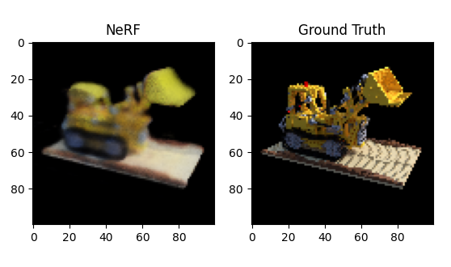

# nerf-from-scratch
Implementing "Neural Radiance Fields" from the original paper.

<hr>

Torch implementation, training after a couple of epochs:



Usages: (dataset download will be automatic)
- `views.py`, examine the NeRF dataset and the generated camera rays
- `train.py`, the NN training script
- `run_model.py`, post-train see model performance qualitatively

<hr>

```
Ben Mildenhall, Pratul P. Srinivasan, Matthew Tancik, Jonathan T. Barron, Ravi Ramamoorthi, & Ren Ng (2020). NeRF: Representing Scenes as Neural Radiance Fields for View Synthesis. In ECCV.
```